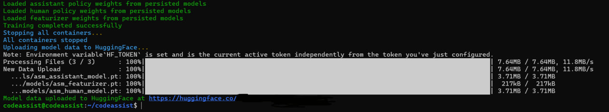

# CodeAssist – Setup Guide for VPS

This guide provides step-by-step instructions to set up [CodeAssist](https://github.com/gensyn-ai/codeassist) on a VPS environment (Ubuntu, WSL, or similar).

> Note: This is an unofficial community guide; for the official repository and advanced usage refer to the [CodeAssist project on GitHub](https://github.com/gensyn-ai/codeassist).

---

## Table of Contents
- [1. Requirements](#1-requirements)  
- [2. Installation](#2-installation)    
- [3. Restarting the Service](#3-restarting-the-service)

  ---
  
# ⚙️ 1. Requirements

- Ubuntu or WSL
- Python 3.10+
- SSH access to VPS
- 12GB RAM (32GB recommended)
- 50GB storage

---

# 🚀 2. Installation Steps

> **NOTE - I am Using Google cloud service for running CodeAssist & starting a SSH connection through my WSL**
### Step 1️⃣: SSH KEY FROM WSL

```bash
ssh-keygen -t ed25519 -C "codeassist"
```

**If you are using other VPS providers then use { root } at "codeassist".**

After using this command in your WSL press enter 3 times(ignore the passphrase line) now use below command to get the ssh key 

```bash
cat ~/.ssh/id_ed25519.pub
```

Now save your ssh key in the notepad & now create your vps with your WSL ssh key.

> **NOTE - If you are using Google cloud then set your name { codeassist }.**

---

### Step 2️⃣: TURNING WSL INTO VPS

```bash
ssh -i ~/.ssh/id_ed25519 username@<your_external_ip>
```

As previously I mentioned the username for GCP & other vps users go with {root}, root users after using above command write your vps password & now your WSL changed into your VPS.

---

### Step 3️⃣: DOCKER & PYTHON

```bash
sudo apt update && sudo apt install docker.io git -y
sudo systemctl enable docker
sudo systemctl start docker
sudo usermod -aG docker $USER
newgrp docker
```

```bash
sudo apt install python3 python3-venv python3-pip curl -y
```

---

### Step 4️⃣: CLONE REPO & UV INSTALL

```bash
git clone https://github.com/gensyn-ai/codeassist.git
```

```bash
curl -LsSf https://astral.sh/uv/install.sh | sh
source ~/.bashrc
```

```bash
uv venv
uv sync
```

---

### Step 5️⃣: DIRECTORY & RUN

```bash
cd codeassist
source .venv/bin/activate
uv run --active python run.py
```

- **> NOTE - After using run command, then you will need to paste your Hugging face token.**
- For hugging face token head over to [HUGGING FACE](https://huggingface.co/docs/hub/en/security-tokens) and generate a token with ```Write``` access.

  ---
  
### Step 6️⃣: 

- After entering the hf token wait for the process
- Now OPEN a new tab/terminal of WSL & paste below command 

```bash
ssh -i ~/.ssh/id_ed25519 -f -N \
  -L 3000:localhost:3000 \
  -L 8000:localhost:8000 \
  -L 8001:localhost:8001 \
  -L 8008:localhost:8008 \
  username@<your_external_ip>
```

- **Replace username & ip address, now open your default browser head over to http://localhost:3000/**
- **You can login now to your CODEASSIST without any error**
- **LFG ! SOLVE THE PROBLEMS ASAP**

---

  ### Step 7️⃣: COMPLETE YOUR TRAINING

  - **when you get tired of coding go to the terminal(1) of WSL & use ```CTRL``` ```C``` for uploading you training data.**

  
---

# ♻️3. Restarting the service

 1️⃣. **IN WSL TERIMINAL #1**

 ```bash
ssh -i ~/.ssh/id_ed25519 username@<your_external_ip>
```

 2️⃣. **IN WSL TERMINAL #1** 
 
```bash
cd codeassist
source .venv/bin/activate
uv run --active python run.py
```

 3️⃣. **IN WSL TERMINAL #2**

```bash
ssh -i ~/.ssh/id_ed25519 -f -N \
  -L 3000:localhost:3000 \
  -L 8000:localhost:8000 \
  -L 8001:localhost:8001 \
  -L 8008:localhost:8008 \
  username@<your_external_ip>
```

-  **RUN the above command just like previously you did in Step 6️⃣ & you good to go.**

---

**If you have any issue then open a issue on this repo or Dm me on my telegram [SONU](https://t.me/Sonu9900)**

**MADE WITH 💖 BY SONU** 

**THANKYOU 🙏**
              
