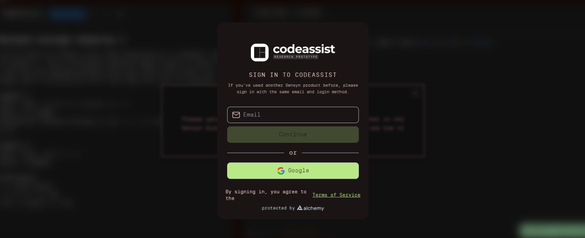

# 🧠 CodeAssist – Setup Guide for VPS

This guide provides step-by-step instructions to set up [CodeAssist](https://github.com/gensyn-ai/codeassist) on a VPS environment (Ubuntu, WSL, or similar).


> Note: This is an unofficial community guide; for the official repository and advanced usage refer to the [CodeAssist project on GitHub](https://github.com/gensyn-ai/codeassist).

---

## 📋 Table of Contents
- [1. Requirements](#1-requirements)  
- [2. Installation](#2-installation)    
- [3. Restarting the Service](#3-restarting-the-service)

  ---
  
# ⚙️ 1. Requirements

- Ubuntu or WSL
- Python 3.10+
- SSH access to VPS
- 12GB RAM
- 50GB storage

---

# 🚀 2. Installation Steps

> **NOTE - I am Using Google cloud service for running CodeAssist & starting a SSH connection through my WSL**
### Step 1️⃣: Generate SSH Key in WSL

```bash
ssh-keygen -t ed25519 -C "codeassist"
```

**If you’re using other VPS providers, use `root` instead of "codeassist".**

- After running the above command in WSL, press Enter three times (ignore the passphrase line). Then use the command below to retrieve your SSH key: 

```bash
cat ~/.ssh/id_ed25519.pub
```

Save your SSH key in a notepad and create your VPS using this WSL SSH key.

> **NOTE - If you’re using Google Cloud, set your username to `codeassist`.**

---

### Step 2️⃣: Connect WSL to VPS

```bash
ssh -i ~/.ssh/id_ed25519 username@<your_external_ip>
```

- As mentioned earlier, use `codeassist` for GCP or `root` for other VPS providers. After executing the command, enter your VPS password if you are on on another vps.
Your WSL is now connected to your VPS.

---

### Step 3️⃣: Install Docker & Python

```bash
sudo apt update && sudo apt install docker.io git -y
sudo systemctl enable docker
sudo systemctl start docker
sudo usermod -aG docker $USER
newgrp docker
```

```bash
sudo apt install python3 python3-venv python3-pip curl -y
```

---

### Step 4️⃣: Clone Repository & Install UV

```bash
git clone https://github.com/gensyn-ai/codeassist.git
```

```bash
curl -LsSf https://astral.sh/uv/install.sh | sh
source ~/.bashrc
```

```bash
uv venv
uv sync
```

---

### Step 5️⃣: Run the CodeAssist

```bash
cd codeassist
source .venv/bin/activate
uv run --active python run.py
```

- **> NOTE - After running this command, you’ll need to paste your Hugging Face token.
Generate one with `Write` access at [HUGGING FACE](https://huggingface.co/docs/hub/en/security-tokens)**

  ---
  
### Step 6️⃣: Create SSH Tunnel

- After entering your Hugging Face token, wait for the setup process to complete.
Then open a new WSL terminal tab and run: 

```bash
ssh -i ~/.ssh/id_ed25519 -f -N \
  -L 3000:localhost:3000 \
  -L 8000:localhost:8000 \
  -L 8001:localhost:8001 \
  -L 8008:localhost:8008 \
  username@<your_external_ip>
```

- **Replace username and ip with your VPS details.**
- **Now open your browser and go to http://localhost:3000/**
- **You can now log in to CodeAssist without any errors.**

  
  
- **LFG! Solve your problems ASAP ⚡**
️
---

  ### Step 7️⃣: Complete Your Training

  - **When you’re done coding, go to terminal (1) in WSL and press:
`CTRL` + `C`
This uploads your training data.**

 
 
---

# ♻️3. Restarting the service

 1️⃣. **IN WSL TERIMINAL #1**

 ```bash
ssh -i ~/.ssh/id_ed25519 username@<your_external_ip>
```

 2️⃣. **IN WSL TERMINAL #1** 
 
```bash
cd codeassist
source .venv/bin/activate
uv run --active python run.py
```

 3️⃣. **IN WSL TERMINAL #2**

```bash
ssh -i ~/.ssh/id_ed25519 -f -N \
  -L 3000:localhost:3000 \
  -L 8000:localhost:8000 \
  -L 8001:localhost:8001 \
  -L 8008:localhost:8008 \
  username@<your_external_ip>
```

-  **Run the above command just like in Step 6️⃣, and you’re good to go.**

---

> 💬 Support

**If you face any issues, open an Issue on this repo or message me on Telegram → [SONU](https://t.me/Sonu9900)**

**Made with 💖 by SONU** 

**Thank you 🙏**
              
